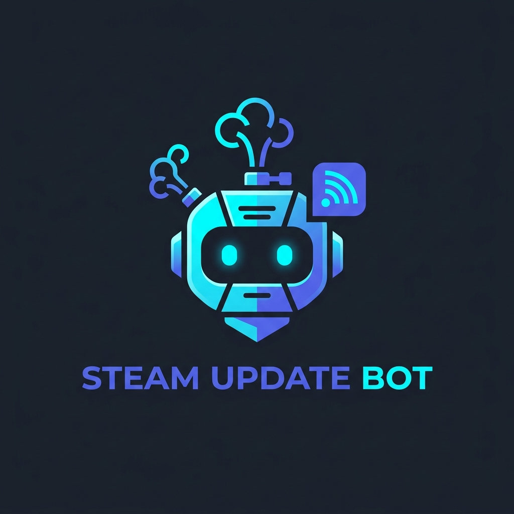

<p align="center">
  
</p>

<h1 align="center">Steam Update Bot</h1>

<p align="center">
  <strong>Patch notes, in Discord, when they actually drop.</strong><br />
  A single-tenant, self-hosted Discord bot that monitors official Steam community announcements for the games you care about.
</p>

<p align="center">
  <a href="https://github.com/TheSameCat2/steam-update-bot/actions/workflows/ci.yml"></a>
  <a href="https://github.com/TheSameCat2/steam-update-bot/pkgs/container/steam-update-bot"></a>
  <a href="https://github.com/TheSameCat2/steam-update-bot/blob/main/LICENSE"></a>
  
  
</p>

---

## Why Steam Update Bot?

Public multi-tenant Discord bots often come with paid tiers, spammy command replies, shared queue delays, and security concerns. **Steam Update Bot** is built specifically for homelabbers, self-hosters, and gaming groups who want a dedicated, private, and reliable solution.

- **Zero API Keys Required**: Consumes Steam's public community news feeds directly. You do not need a Steam developer account or Web API key.
- **Signal Over Noise**: Posts patch notes, hotfixes, roadmaps, and major news. It ignores silent Steam depot or build bumps, alerting only when developers publish actual news.
- **Pristine Channels**: All slash commands (`/steam add`, `/steam list`, `/steam status`) respond ephemerally. Your announcement channel stays completely uncluttered.
- **Smart Baselining**: Adding a game silently baselines its existing announcements so your server is not spammed with historical backlog.
- **Guaranteed At-Least-Once Delivery**: Powered by an EF Core SQLite transactional outbox with Write-Ahead Logging (WAL). Even if Discord has an outage or rate-limits requests, announcements queue safely and retry automatically.
- **Homelab Ready**: Multi-arch container image (`linux/amd64` and `linux/arm64`), minimal memory footprint (< 512 MB), built-in health probes, and first-class Unraid support.

---

## Quick Start with Docker Compose

Deploy the official multi-arch container image published on GHCR:

```sh
# 1. Clone the repository
git clone https://github.com/TheSameCat2/steam-update-bot.git
cd steam-update-bot

# 2. Copy and configure environment variables
cp .env.example .env
# Edit .env with your Discord Bot Token and Server IDs

# 3. Pull and start the container
docker compose pull
docker compose up -d
docker compose logs -f steam-update-bot
```

Once you see `Discord gateway ready for guild` in the logs, the bot has registered its slash commands in your server.

To start tracking a game:
1. Find the game's **App ID** on its Steam Store page (the number in `store.steampowered.com/app/570/`).
2. Run `/steam add app-id:570` in Discord.

The bot will silently baseline existing posts, and new patch notes will be delivered directly to your announcement channel.

---

## Discord Setup

1. **Create Application**: Go to the [Discord Developer Portal](https://discord.com/developers/applications) and create a new Application.
2. **Configure Bot**: Under the **Bot** tab, generate a token. Uncheck *Public Bot* if you want to keep it private to your server.
3. **Invite to Server**: Under **OAuth2 -> URL Generator**, select the `bot` and `applications.commands` scopes.
4. **Channel Permissions**: Grant the bot the following minimal permissions in your announcement channel:
   - **View Channel**
   - **Send Messages**
   - **Embed Links**
   *(Administrator, Message Content, and Read History permissions are **not** needed).*
5. **Collect IDs**: Enable Discord Developer Mode (*User Settings -> Advanced -> Developer Mode*), then right-click to copy:
   - Your **Server (Guild) ID**
   - Your **Announcement Channel ID**
   - Your **Manager Role ID** (members with this role or Server Administrators can add/remove games)
6. Add these IDs and your token to `.env`.

---

## Recommended Setup on Unraid

Unraid users can run Steam Update Bot via Portainer, Compose Manager Plus, or the Docker Compose CLI plugin.

### 1. Create the Appdata Directory

The container runs as an unprivileged user (UID `1654`). A bind mount preserves host ownership, so set ownership before starting:

```sh
mkdir -p /mnt/user/appdata/steam-update-bot/data
chown -R 1654:1654 /mnt/user/appdata/steam-update-bot/data
```

> **Why appdata?** Storing the database in `/mnt/user/appdata/` ensures it is included in Unraid's **Appdata Backup** plugin and survives Docker vDisk recreations.

### 2. Configure the Stack

Copy `compose.yaml` and `.env.example` into your stack editor, then set `BOT_DATA_PATH`:

```ini
BOT_DATA_PATH=/mnt/user/appdata/steam-update-bot/data
```

> **Security Tip**: Protect your `.env` file (`chmod 600`) and ensure your appdata share is not exported over public SMB/NFS shares.

### 3. Deploy & Verify

```sh
docker compose pull
docker compose up -d
curl -s http://127.0.0.1:8080/health/ready
```

A clean installation returns `Healthy`. Monitored games begin polling automatically within the configured interval (default: 5 minutes).

---

## Slash Commands

All slash command replies are **ephemeral** (visible only to the user invoking them), keeping announcement channels clean.

| Command | Permission | Description |
| :--- | :--- | :--- |
| `/steam add app-id:<number>` | Manager Role or Admin | Validates the Steam game, records a silent baseline, and begins polling for new announcements. |
| `/steam remove app-id:<number>` | Manager Role or Admin | Stops monitoring the game and purges any pending deliveries for it. |
| `/steam list [page:<number>]` | All Server Members | Lists all monitored games in the server (20 games per page). |
| `/steam status [app-id:<number>]` | All Server Members | Displays real-time bot health, connection state, outbox statistics, or detailed status for a specific game. |

---

## Configuration Reference

Configuration can be provided through `.env` or container environment variables:

| Variable | Default | Description |
| :--- | :--- | :--- |
| `Discord__Token` | *(Required)* | Bot token from Discord Developer Portal. |
| `Discord__GuildId` | *(Required)* | Target Discord server (guild) snowflake ID. |
| `Discord__AnnouncementChannelId` | *(Required)* | Channel snowflake ID where announcements are posted. |
| `Discord__ManagerRoleId` | *(Required)* | Role snowflake ID authorized to add and remove games. |
| `BOT_DATA_PATH` | Named volume | Absolute host directory path for SQLite database persistence. |
| `BOT_PORT` | `127.0.0.1:8080` | Host IP and port binding for local healthcheck probes. |
| `IMAGE_TAG` | `latest` | GHCR container image tag (`latest`, `sha-<commit>`, or semver). |
| `Steam__PollIntervalMinutes` | `5` | Minutes between poll cycles per game (1–60). |
| `Steam__MaxConcurrentPolls` | `4` | Max concurrent HTTP requests to Steam during a cycle (1–8). |
| `Steam__MaxGames` | `50` | Maximum number of monitored games allowed (1–50). |
| `Steam__OverlapHours` | `24` | Overlap window in hours for deduplicating Steam news queries (1–48). |
| `Steam__RequestTimeoutSeconds` | `15` | Timeout in seconds for individual Steam HTTP requests (5–60). |

---

## Architecture & Reliability

### At-Least-Once Delivery & Outbox Pattern
Steam announcements are discovered and saved to an SQLite outbox inside an EF Core transaction. The delivery worker dequeues pending announcements and posts them to Discord with rate-limiting backoff.
- **Failures & Retries**: Transient HTTP errors (rate limits, network timeouts, 5xx) retry automatically without exhausting the poison delivery budget.
- **Safety Thresholds**: If an announcement remains undelivered for over 1 hour, `/health/ready` reports a degraded state and `/steam status` flags the oldest undelivered item.

### SQLite WAL Mode
The database operates in **Write-Ahead Logging (WAL)** mode with busy timeout handling, preventing locks between polling and Discord delivery workers. When backing up manually, make sure to copy `steam-update-bot.db`, `steam-update-bot.db-wal`, and `steam-update-bot.db-shm` together (or stop the container first).

### Health Endpoints
Bound strictly to `127.0.0.1:8080` by default:
- `GET /health/live`: Process liveness probe used by Docker `HEALTHCHECK`. Remains healthy across transient Discord reconnects; exits cleanly after 10 minutes disconnected so Docker can restart the container.
- `GET /health/ready`: Operational readiness probe verifying SQLite database connectivity, Discord gateway state, outbox delivery drain, and freshness of Steam polling.

---

## Local Development

Requirements: [.NET 10 SDK](https://dotnet.microsoft.com/download)

```sh
# Restore dependencies
dotnet restore SteamUpdateBot.sln

# Build release configuration
dotnet build SteamUpdateBot.sln --no-restore --configuration Release

# Run automated tests
dotnet test SteamUpdateBot.sln --no-build --configuration Release

# Format code according to style rules
dotnet format SteamUpdateBot.sln --verify-no-changes --no-restore

# Run the app locally
dotnet run --project src/SteamUpdateBot.App
```

For local testing, configure credentials using .NET User Secrets:
```sh
dotnet user-secrets init --project src/SteamUpdateBot.App
dotnet user-secrets set --project src/SteamUpdateBot.App "Discord:Token" "your-bot-token"
dotnet user-secrets set --project src/SteamUpdateBot.App "Discord:GuildId" "your-guild-id"
dotnet user-secrets set --project src/SteamUpdateBot.App "Discord:AnnouncementChannelId" "your-channel-id"
dotnet user-secrets set --project src/SteamUpdateBot.App "Discord:ManagerRoleId" "your-role-id"
```

---

## License

This project is open-source software licensed under the [MIT License](LICENSE).
